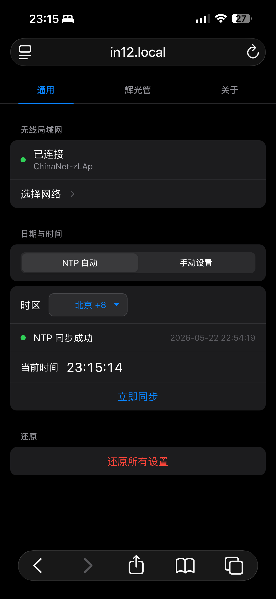
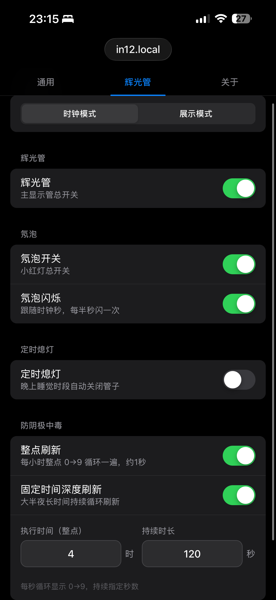

# IN12 辉光管时钟

基于 ESP32 开发的 IN-12 辉光管时钟项目。

## 项目展示

### Web 控制后台
|                    WIFI & NTP                    |                      辉光管设置                       |
|:------------------------------------------------:|:------------------------------------------------:|
|  |  |

## 资源说明
项目相关的设计文件均存放于 `resources` 目录下：
- **PCB & 电路图**：位于 `resources/PCB&电路图/`（[立创开源平台](https://oshwhub.com/kivvi3412/project_mipmqddo)）
- **亚克力面板图纸**：位于 `resources/面板亚克力图纸/`（包含 DXF 和 F3D 格式）
- **视频演示**：[Bilibili 视频链接](https://www.bilibili.com/video/BV1PiGb6sE5W)

## 快速开始

### 硬件要求
- ESP32 开发板
- IN-12 辉光管及驱动电路

### 编译与烧录
1. **环境准备**：安装 ESP-IDF 开发环境。
2. **配置项目**：`idf.py menuconfig`
3. **编译烧录**：`idf.py build flash monitor`

## 使用说明
1. **首次连接**：时钟启动后会开启热点。
   - **WIFI SSID**: `IN12`
   - **WIFI Password**: `in12clock`
2. **访问控制台**：
   - 浏览器访问：[http://in12.local](http://in12.local)
   - mDNS 主机名：`in12`
   - 服务名称：`IN12 Nixie Web Config`
3. **网络配置**：在网页端配置 WiFi 后，系统将自动同步 NTP 时间。

---
